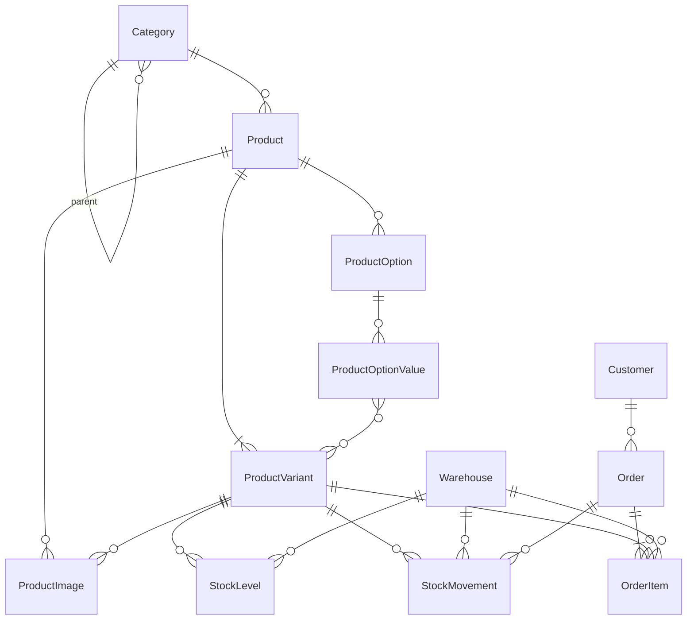
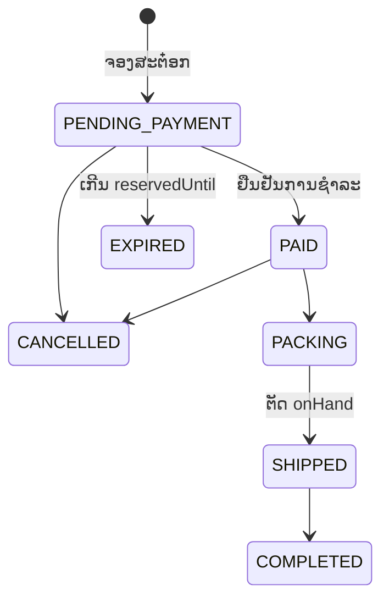

# 🗄️ Database: OmniCommerce AI (OCA)

Schema ຢູ່ທີ່ [packages/database/prisma/schema.prisma](../packages/database/prisma/schema.prisma). ປັດຈຸບັນກວມເອົາ **ໂມດູນ 7** (ສິນຄ້າ, variants, ສະຕ໋ອກສູນກາງ, ຄຳສັ່ງຊື້) ສຳລັບຮ້ານດຽວ.

---

## ERD



`StoreSetting` (ແຖວດຽວ) ແລະ `ExchangeRate` ບໍ່ມີ relation ກັບຕາຕະລາງອື່ນ.

---

## ຫຼັກການອອກແບບ

### ສິນຄ້າ ແລະ Variants
* `ProductVariant` ແມ່ນໜ່ວຍທີ່ຂາຍ ແລະ ນັບສະຕ໋ອກ. ສິນຄ້າທີ່ບໍ່ມີຕົວເລືອກກໍຕ້ອງມີ 1 variant.
* ຕົວເລືອກ (ສີ, ໄຊສ໌) ເກັບເປັນໂຄງສ້າງ `ProductOption` → `ProductOptionValue` ເພື່ອໃຫ້ CF Engine (ໂມດູນ 4) ຈັບຄູ່ຂໍ້ຄວາມເຊັ່ນ `ດຳ M 1` ກັບ variant ໄດ້.
* `sku` ແລະ `barcode` ບໍ່ຊ້ຳກັນທັງລະບົບ (ໃຊ້ກັບ Scan-to-Pack ໃນໂມດູນ 8).

### ເງິນ
* ລາຄາ, ຕົ້ນທຶນ ແລະ ຍອດໃນຄຳສັ່ງຊື້ທັງໝົດເກັບເປັນ `StoreSetting.baseCurrency` (ຄ່າເລີ່ມຕົ້ນ LAK).
* `Order.currency` + `Order.exchangeRate` ບັນທຶກສະກຸນທີ່ລູກຄ້າຈ່າຍ ແລະ ອັດຕາ ນະ ເວລາສັ່ງຊື້.
* `OrderItem` ເກັບ snapshot ຂອງຊື່, SKU, ລາຄາ ແລະ ຕົ້ນທຶນ ເພື່ອໃຫ້ລາຍງານ P&L ບໍ່ປ່ຽນເມື່ອແກ້ໄຂສິນຄ້າພາຍຫຼັງ.

### ສະຕ໋ອກສູນກາງ
* `StockLevel` ເກັບຍອດຕໍ່ variant ຕໍ່ສາງ: **ຂາຍໄດ້ = `onHand` - `reserved`**.
* `StockMovement` ເປັນບັນຊີການເຄື່ອນໄຫວແບບເພີ່ມຢ່າງດຽວ. ທຸກການປ່ຽນ `StockLevel` ຕ້ອງຂຽນ `StockMovement` ໃນ transaction ດຽວກັນ.

| ເຫດການ | type | onHand | reserved |
|---|---|---|---|
| ຮັບສິນຄ້າເຂົ້າ | `RECEIVE` | + | |
| ສ້າງຄຳສັ່ງຊື້ (ຈອງ) | `RESERVE` | | + |
| ຍົກເລີກ / ໝົດເວລາຈອງ | `RELEASE` | | - |
| ສົ່ງສິນຄ້າອອກ | `SHIP` | - | - |
| ລູກຄ້າສົ່ງຄືນ | `RETURN` | + | |
| ປັບຍອດ | `ADJUST` | +/- | |
| ຍ້າຍສາງ | `TRANSFER_OUT` / `TRANSFER_IN` | - / + | |

### ການປ້ອງກັນຂາຍເກີນ (Overselling)
ການຈອງຕ້ອງເຮັດດ້ວຍຄຳສັ່ງ UPDATE ທີ່ມີເງື່ອນໄຂ, ຫ້າມອ່ານຍອດກ່ອນແລ້ວຂຽນທັບ:

```sql
UPDATE "StockLevel"
SET "reserved" = "reserved" + $qty
WHERE "variantId" = $variantId
  AND "warehouseId" = $warehouseId
  AND "onHand" - "reserved" >= $qty;
-- ຖ້າ 0 ແຖວຖືກແກ້ = ສິນຄ້າບໍ່ພໍ -> ປະຕິເສດຄຳສັ່ງຊື້
```

ຖານຂໍ້ມູນມີ CHECK constraint `0 <= reserved <= onHand` ເປັນດ່ານສຸດທ້າຍ ຖ້າໂຄດຂ້າມເງື່ອນໄຂຂ້າງເທິງ.

ການປ່ຽນ `StockLevel` ທັງໝົດຕ້ອງຜ່ານ `packages/database/src/inventory/stock-engine.ts` ເທົ່ານັ້ນ. ການຈອງ/ປ່ອຍ/ຕັດຫຼາຍລາຍການຮຽງຕາມ `(variantId, warehouseId)` ກ່ອນ UPDATE ເພື່ອກັນ deadlock; `transfer` ເຮັດຕາມລຳດັບ `warehouseId`. Invariant ທີ່ test ກວດ: `onHand = Σ(RECEIVE+RETURN+TRANSFER_IN+ADJUST) − Σ(SHIP+TRANSFER_OUT)` ແລະ `reserved = Σ RESERVE − Σ RELEASE − Σ SHIP` ຕໍ່ (variant, ສາງ).

### ວົງຈອນຄຳສັ່ງຊື້



* `EXPIRED` ແລະ `CANCELLED` ຕ້ອງຄືນຍອດຈອງ (`RELEASE`).
* Worker ຊອກຄຳສັ່ງຊື້ທີ່ໝົດເວລາດ້ວຍ index `(status, reservedUntil)`.
* ເວລາຈອງມາຈາກ `StoreSetting.reservationMinutes` (ຄ່າເລີ່ມຕົ້ນ 30 ນາທີ, ກວມ 1–10080; CHECK ໃນ migration `20261005000000_inventory`). ບິນໜຶ່ງ override ໄດ້ຕອນສ້າງ.
* ເລກບິນມາຈາກ sequence `"Order_number_seq"` ຮູບແບບ `SO-000001`. Rollback ເຮັດໃຫ້ເລກຂາດໄດ້.

---

## Constraint ທີ່ຂຽນດ້ວຍມືໃນ migration

Prisma schema ບໍ່ຮອງຮັບ CHECK ແລະ partial index, ຈຶ່ງຂຽນເພີ່ມທ້າຍ [migration ທຳອິດ](../packages/database/prisma/migrations/20261004000000_init/migration.sql):

* `StockLevel`: `onHand >= 0`, `reserved >= 0`, `reserved <= onHand`
* `StoreSetting`: ມີໄດ້ແຖວດຽວ (`id = 1`)
* `Warehouse`: ມີສາງ default ໄດ້ພຽງສາງດຽວ
* `OrderItem`: `quantity > 0`
* `StockMovement`: `quantity` ເປັນບວກ, ຍົກເວັ້ນ `ADJUST` ທີ່ຕິດລົບໄດ້

---

## ຄຳສັ່ງ

```bash
pnpm --filter @oca/database db:validate   # ກວດ schema
pnpm --filter @oca/database db:generate   # ສ້າງ Prisma Client
pnpm --filter @oca/database db:migrate    # ສ້າງ/ລັນ migration (dev)
pnpm --filter @oca/database db:deploy     # ລັນ migration (production)
```

## ຍັງບໍ່ທັນມີ (ຈະເພີ່ມຕາມໂມດູນ)

* ການຊຳລະເງິນ ແລະ ສະລິບ (ໂມດູນ 9)
* ລະຫັດ CF ຂອງສິນຄ້າໃນ Live (ໂມດູນ 4)
* ພັດສະດຸ ແລະ ເລກ Tracking (ໂມດູນ 8)
* ບັນຊີໂຊຊ້ຽວຂອງລູກຄ້າ, ແຕ້ມ, ລະດັບ VIP (ໂມດູນ 1, 11)
* ພະນັກງານ ແລະ ສິດ (ໂມດູນ 12): `StockMovement.actorId` ຍັງເປັນ String ທຳມະດາ

## Auth & RBAC (Phase 0)

| ຕາຕະລາງ | ໜ້າທີ່ |
|---|---|
| `User` | ພະນັກງານ: email (unique), passwordHash (argon2id), 1 role ຕໍ່ 1 ຄົນ, `isActive` |
| `Role` | Role ປັບແຕ່ງໄດ້; `isSystem` (OWNER) ລຶບ ຫຼື ແກ້ permission ບໍ່ໄດ້ |
| `RolePermission` | permission ຂອງ role ເປັນ string `module:action` (ລາຍການຢູ່ `@oca/shared`, ບໍ່ແມ່ນຕາຕະລາງ) |
| `RefreshToken` | refresh token ແບບ rotation; ເກັບສະເພາະ hash; `familyId` ໃຊ້ revoke ທັງຕະກູນເມື່ອພົບການໃຊ້ຊ້ຳ; ມີ index ທີ່ `expiresAt`; worker ລຶບແຖວທີ່ໝົດອາຍຸ >1 ມື້ ຫຼື ຖືກ revoke >7 ມື້ ທຸກວັນ 03:00 (job `cleanup-refresh-tokens`) |
| `AuditLog` | ບັນທຶກແບບເພີ່ມຢ່າງດຽວ: action, entity, before/after (JSON), ip |

Seed (`pnpm db:seed`) ສ້າງ role OWNER (ລະບົບ), MANAGER, CHAT_ADMIN, WAREHOUSE, ACCOUNTANT ແລະ ຜູ້ໃຊ້ OWNER ຈາກ `SEED_OWNER_EMAIL` / `SEED_OWNER_PASSWORD`. Run ຊ້ຳໄດ້: sync permission ຂອງ OWNER ທຸກຄັ້ງ, ບໍ່ຂຽນທັບ role ອື່ນ ຫຼື ລະຫັດຜ່ານທີ່ມີຢູ່ແລ້ວ.
