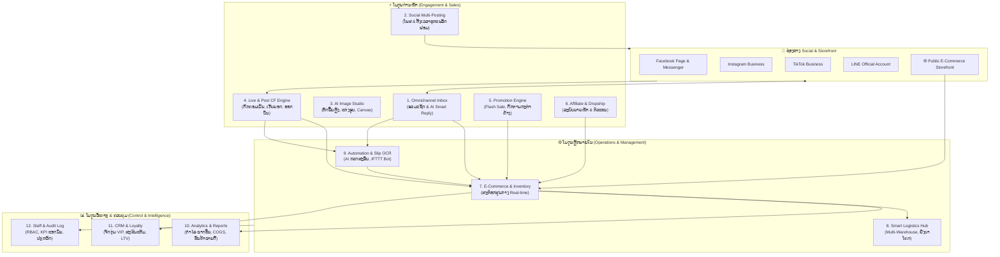

# 🚀 Enterprise System Blueprint: OmniCommerce AI (OCA)

ເອກະສານສະຖາປັດຕະຍະກຳ ແລະ ແຜນພິມຂຽວລະບົບສະບັບເຕັມ 12 ໂມດູນສຳລັບ OmniCommerce AI.

> **ຂອບເຂດ:** ໄລຍະທຳອິດພັດທະນາເປັນຮ້ານດຽວ (single-store), ຍັງບໍ່ແມ່ນ SaaS ຫຼາຍຮ້ານ. ເບິ່ງ [ADR 0001](adr/0001-single-store-first.md) ແລະ [ROADMAP](ROADMAP.md).

---

## 🏗️ ພາບລວມສະຖາປັດຕະຍະກຳ (Architecture Diagram)

---

## 📌 ລາຍລະອຽດທັງ 12 ໂມດູນແບບເຈາະເລິກ

### 1. Omnichannel Inbox (ຮວມສູນກາງແຊັດ)
* **Unified Socket Stream:** ດຶງຂໍ້ຄວາມຈາກ Facebook, IG, TikTok, LINE ເຂົ້າມາແບບ Real-time ຜ່ານ Webhook & WebSockets.
* **AI Co-pilot Assist:** ສະຫຼຸບແຊັດທີ່ຜ່ານມາ, ແນະນຳປະໂຫຍກຕອບລູກຄ້າຕາມສຽງຂອງແບຣນ (Brand Tone).
* **Direct Order Creation:** ເປີດບິນ, ເລືອກສິນຄ້າຈາກສະຕ໋ອກ, ສົ່ງລິ້ງຊຳລະເງິນໃຫ້ລູກຄ້າໃນແຊັດໄດ້ທັນທີ.
* **Auto-Routing:** ແບ່ງແຊັດໃຫ້ແອດມິນແຕ່ລະຄົນອັດຕະໂນມັດ (Round-robin ຫຼື ຕາມໜ້າທີ່ຮັບຜິດຊອບ).

### 2. Social Multi-Posting & Content Scheduler (ໂພສ ແລະ ຕັ້ງເວລາ)
* **One-Click Multi-Publish:** ອັບໂຫຼດຮູບ/ວິດີໂອ, ຂຽນເນື້ອຫາຄັ້ງດຽວ ແລ້ວກະຈາຍໄປລົງທຸກແພລັດຟອມ.
* **Media Optimization:** ປັບຂະໜາດຮູບ ແລະ ວິດີໂອໃຫ້ເໝາະສົມກັບແຕ່ລະແພລັດຟອມອັດຕະໂນມັດ (Reels, TikTok, Feed).
* **AI Copywriter:** ສ້າງແຄັບຊັນດຶງດູດ, ບົດຄວາມຂາຍ, ແຮຊແທັກທີ່ກຳລັງຕິດເທຣນ.
* **Calendar Scheduler:** ຕາຕະລາງ Drag & Drop ສຳລັບຈັດວາງແຜນການໂພສລ່ວງໜ້າເປັນເດືອນ.

### 3. AI Image Studio (ແຕ່ງຮູບສິນຄ້າອັດສະລິຍະ)
* **Web Canvas Editor:** ເຄື່ອງມືແຕ່ງຮູບແບບ Canvas (Fabric.js) ສຳລັບຈັດ Layer, ໃສ່ຕົວໜັງສື, ລາຄາ, ໂລໂກ້.
* **One-Click Background Removal:** ຕັດພື້ນຫຼັງສິນຄ້າອອກອັດຕະໂນມັດດ້ວຍ AI.
* **AI Scene Generator:** ປ່ຽນພື້ນຫຼັງເປັນສະຕູດິໂອລະດັບສາກົນຕາມ Prompt.
* **Batch Watermarking:** ໃສ່ລາຍນໍ້າ ແລະ ໂລໂກ້ຮ້ານໃສ່ຮູບສິນຄ້າທັງໝົດໃນຄລິກດຽວ.

### 4. Live & Post CF Engine (ລະບົບ CF / ເກັບຍອດ / ດັກຄອມເມັ້ນ)
* **Ultra-Fast Comment Webhook:** ດັກຟັງຄອມເມັ້ນເວລາ Live Stream ຮອງຮັບຫຼາຍພັນຄອມເມັ້ນຕໍ່ວິນາທີ ດ້ວຍ Redis Queue.
* **Smart CF Regex:** ຮອງຮັບຮູບແບບ CF ຫຼາກຫຼາຍ: `A1`, `B02 2`, `ດຳ M 1`.
* **Auto-Inbox & Dynamic Invoice:** ເມື່ອລູກຄ້າ CF ລະບົບຈະທັກແຊັດພ້ອມສົ່ງໃບບິນ QR Code ທີ່ມີເວລານັບຖອຍຫຼັງການຈອງ.
* **Real-time Host Screen:** ໜ້າຈໍສະແດງຜົນສຳລັບຜູ້ Live ສົດ (ເຫັນຈຳນວນຄົນ CF, ສະຕ໋ອກທີ່ເຫຼືອ, ຍອດຂາຍ).

### 5. Promotion & Marketing Engine (ໂປຣໂມຊັ່ນ ແລະ ແຄມເປນ)
* **Flash Sale System:** ຕັ້ງເວລາຫຼຸດລາຄາຕາມຊ່ວງເວລາພິເສດ ພ້ອມໂມງນັບຖອຍຫຼັງ.
* **Bundle & Upselling Rules:** ຊື້ຄູ່ຖືກກວ່າ, ໂປຣ 1 ແຖມ 1, ແນະນຳສິນຄ້າພ່ວງຕອນ Checkout.
* **Abandoned Cart Auto-Recovery:** ດັກສົ່ງແຊັດເຕືອນພ້ອມໂຄດສ່ວນຫຼຸດພິເສດເມື່ອລູກຄ້າປະຖິ້ມກະຕ່າເກີນ 1 ຊົ່ວໂມງ.

### 6. Affiliate & Influencer / Dropship (ນາຍໜ້າ ແລະ ຕົວແທນ)
* **Affiliate Referral Links:** ສ້າງລິ້ງໃຫ້ນາຍໜ້າ / KOL ນຳໄປໂປຣໂມດ ພ້ອມຄິດໄລ່ຄ່ານາຍໜ້າອັດຕະໂນມັດ.
* **Influencer Dashboard:** ໜ້າຈໍສະເພາະໃຫ້ນາຍໜ້າເບິ່ງຍອດຄລິກ, ຍອດສັ່ງຊື້ ແລະ ເງິນຄ່ານາຍໜ້າທີ່ຖອນໄດ້.
* **Dropship / Reseller Portal:** ລະບົບຕົວແທນຂາຍ (ເຫັນລາຄາສົ່ງ, ດາວໂຫຼດຮູບສິນຄ້າ, ໃຫ້ສາງເຮົາແພັກສົ່ງໃນນາມຕົວແທນ).

### 7. E-Commerce Storefront & Central Inventory (ໜ້າຮ້ານ + ສະຕ໋ອກສູນກາງ)
* **High-Speed Storefront:** ໜ້າເວັບຂາຍສິນຄ້າ (Next.js SSR) ໂຫຼດໄວ, SEO ສົມບູນ, ຮອງຮັບມືຖື 100%.
* **Atomic Inventory Sync:** ລະບົບຕັດສະຕ໋ອກສູນກາງແບບປ້ອງກັນການຊື້ເກີນ (Prevent Overselling) ຕັດພ້ອມກັນທັງເວັບ, ແຊັດ, ແລະ Live.
* **Product Variants:** ຈັດການສິນຄ້າທີ່ມີຫຼາຍສີ, ຫຼາຍໄຊສ໌, ແລະ ບາໂຄດສະເພາະຕົວ.
* **Multi-Currency & Tax:** ຮອງຮັບຫຼາຍສະກຸນເງິນ (LAK, THB, USD) ແລະ ລະບົບຄຳນວນ VAT.

### 8. Smart Logistics Hub & Multi-Warehouse (ຂົນສົ່ງ ແລະ ສາງສິນຄ້າ)
* **Multi-Warehouse Support:** ຮອງຮັບຫຼາຍສາງສິນຄ້າ ຫຼື ຫຼາຍສາຂາ ຕັດສະຕ໋ອກຕາມສາງທີ່ໃກ້ລູກຄ້າ.
* **Barcode Scan-to-Pack:** ລະບົບຍິງບາໂຄດກວດສິນຄ້າກ່ອນປິດກ່ອງ (ປ້ອງກັນການແພັກຜິດ 100%).
* **Courier API Integration:** ເຊື່ອມຕໍ່ບໍລິສັດຂົນສົ່ງ, ສ້າງເລກ Tracking, ແລະ ພິມໃບປະໜ້າ Thermal (100x150mm).
* **Automated Delivery Tracking Alerts:** ແຈ້ງເຕືອນລູກຄ້າຜ່ານແຊັດອັດຕະໂນມັດເມື່ອພັດສະດຸອອກເດີນທາງ.

### 9. Automation Workflows & AI Slip Verification (ລະບົບອັດຕະໂນມັດ & ກວດສະລິບ)
* **AI Slip OCR Verification:** ກວດສອບສະລິບໂອນເງິນອັດຕະໂນມັດ (ອ່ານຍອດ, ວັນທີ, ເວລາ, ເລກບັນຊີ) ແລະ ອັບເດດສະຖານະບິນທັນທີ.
* **IFTTT Automation Rules:** ຕັ້ງເງື່ອນໄຂອັດຕະໂນມັດ ເຊັ່ນ: *"ຖ້າສະຕ໋ອກເຫຼືອຕໍ່າກວ່າ 5 ອັນ -> ແຈ້ງເຕືອນເຂົ້າ Telegram ເຈົ້າຂອງຮ້ານ"*.
* **Broadcast Campaign Automation:** ຍິງຂໍ້ຄວາມຫາລູກຄ້າຕາມກຸ່ມເປົ້າໝາຍຜ່ານ LINE OA ຫຼື SMS.

### 10. Analytics & Financial Reports (ສະຖິຕິ ແລະ ລາຍງານການເງິນ)
* **Real-Time P&L (Profit & Loss):** ຄຳນວນຍອດຂາຍ, ຕົ້ນທຶນສິນຄ້າ (COGS), ຄ່າຂົນສົ່ງ, ຄ່າທຳນຽມ, ເຫັນກຳໄລສຸທິທັນທີ.
* **Cross-Channel Performance:** ປຽບທຽບລາຍຮັບແຍກຕາມຊ່ອງທາງ (Facebook, IG, TikTok, Storefront).
* **Inventory Turnover & Deadstock:** ວິເຄາະສິນຄ້າທີ່ຂາຍອອກໄວ ແລະ ສິນຄ້າຄ້າງສະຕ໋ອກທີ່ຄວນຈັດໂປຣໂມຊັ່ນ.
* **Automated Accounting Export:** ສົ່ງອອກລາຍງານບັນຊີ (CSV, Excel) ເຂົ້າລະບົບບັນຊີໄດ້ງ່າຍດາຍ.

### 11. CRM & Customer Loyalty (ລະບົບລູກຄ້າ ແລະ ສະມາຊິກ)
* **Customer 360 View:** ຮວມປະຫວັດລູກຄ້າ 1 ຄົນ ບໍ່ວ່າຈະເຄີຍທັກມາທາງໃດ ຫຼື ຊື້ຜ່ານເວັບ.
* **Tiered Membership:** ລະບົບລະດັບສະມາຊິກ (Bronze, Silver, Gold, Platinum) ພ້ອມສິດທິພິເສດຕ່າງກັນ.
* **Reward Points:** ສະສົມແຕ້ມຈາກຍອດຊື້ເພື່ອນຳມາແລກເປັນສ່ວນຫຼຸດ.
* **RFM Segmentation:** ແບ່ງກຸ່ມລູກຄ້າຕາມພຶດຕິກຳ (Recency, Frequency, Monetary).

### 12. Multi-Role Team & Staff Management (ຈັດການທີມງານ & ວັດ KPI)
* **Granular RBAC:** ກຳນົດສິດລະອຽດ (Super Admin, Live Host, Chat Support, Warehouse Staff, Accountant).
* **Staff Performance KPI:** ວັດແທກເວລາຕອບແຊັດສະເລ່ຍ, ຍອດປິດການຂາຍ, ແລະ ຈຳນວນກ່ອງທີ່ແພັກຕໍ່ມື້.
* **Audit Trail & Action Logs:** ບັນທຶກປະຫວັດການແກ້ໄຂສະຕ໋ອກ, ຍົກເລີກບິນ, ຫຼື ປັບລາຄາ ປ້ອງກັນການທຸຈະລິດ.
